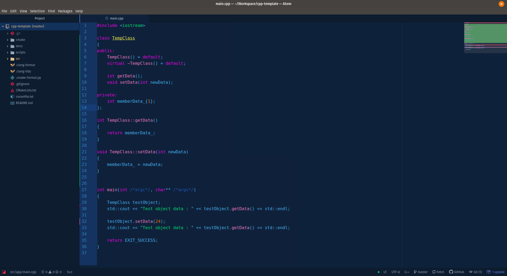
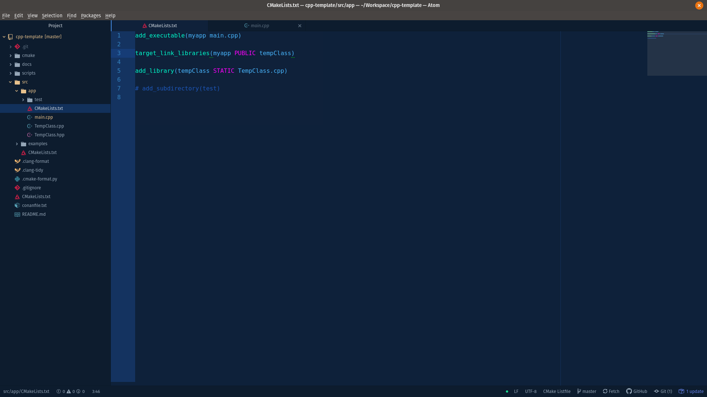

# cyber-theme-syntax theme

Copied from one-dark theme, changed color scheme accordingly.

Only tuning looks with C++ code. Probably too flashy for any kind of serious coding, use with cautious. :sweat_smile:

